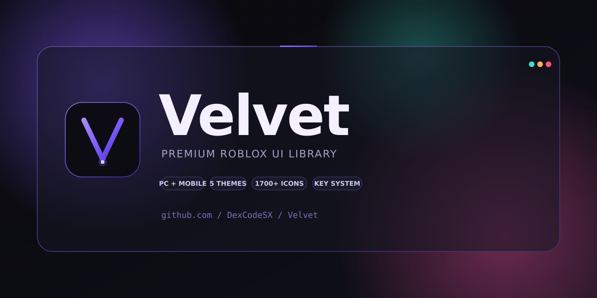

<div align="center">
  

  <p>
    <b>Premium dark glassmorphism UI library for Roblox</b><br/>
    Single loadstring · PC + Mobile · 5 themes · 1700+ icons
  </p>

  <p>
    <a href="LICENSE"></a>
    
    
    
    <a href="https://github.com/DexCodeSX/Velvet/stargazers"></a>
  </p>
</div>

---

## Why Velvet

Other libs feel dated. Velvet is built on the 2026 dark-glassmorphism aesthetic: ambient color orbs, soft inner glows, and microinteractions that land in 200ms. It was designed mobile-first on a tablet and then scaled up to desktop, so touch targets and gestures actually feel right instead of being an afterthought.

- **Live search bar**: type in the header, every element across every tab filters instantly.
- **Active toggle badges**: each tab in the sidebar shows a pill counting how many toggles are on inside it. Glance at the sidebar, know your state.
- **Drag mutex**: the color picker grabs input priority on mobile so the slider underneath stops twitching.
- **Live theme switching**: recolors every existing element when you swap themes. No reload needed.
- **Tagged error system**: every callback runs through `safecall(source, fn)` and routes failures through `Velvet:OnError(fn)` with the exact source label (`Toggle:aimbot`, `Slider:fov`).
- **Pulsing logo halo**: small thing, but the window feels alive.

## Install

```lua
local Velvet = loadstring(game:HttpGet("https://raw.githubusercontent.com/DexCodeSX/Velvet/main/Library.lua"))()
```

### Optional addons

```lua
local SaveManager = loadstring(game:HttpGet("https://raw.githubusercontent.com/DexCodeSX/Velvet/main/addons/SaveManager.lua"))()
local ThemeManager = loadstring(game:HttpGet("https://raw.githubusercontent.com/DexCodeSX/Velvet/main/addons/ThemeManager.lua"))()

SaveManager:Bind(Velvet, "MyConfig")
ThemeManager:Bind(Velvet)
ThemeManager:LoadSaved()
```

## Quick Start

```lua
local Velvet = loadstring(game:HttpGet("https://raw.githubusercontent.com/DexCodeSX/Velvet/main/Library.lua"))()

local Window = Velvet:CreateWindow({
    Title = "My Script",
    SubTitle = "v1.0",
    ToggleKey = Enum.KeyCode.RightShift,
    ToggleIcon = "sparkles", -- lucide icon name (1700+ available)
})

local Tab = Window:AddTab("Combat", "sword")
local Section = Tab:AddSection("Aimbot")

Section:AddToggle("Aimbot", {
    Text = "Enable Aimbot",
    Default = false,
    Callback = function(v) _G.aimbot = v end,
})

Section:AddSlider("FOV", {
    Text = "FOV", Min = 10, Max = 500, Default = 150, Increment = 5,
    Callback = function(v) _G.fov = v end,
})

Section:AddDropdown("TargetPart", {
    Text = "Target Part",
    Values = { "Head", "HumanoidRootPart", "Torso" },
    Default = "Head",
    VisibleWhen = "Aimbot", -- only show while Aimbot toggle is on
})
```

## Examples

| File | What it shows |
|------|---------------|
| [`Example.lua`](Example.lua) | Full feature tour: every element, theme switching, watermark, search, sub-tabs |
| [`KeySystemTest.lua`](KeySystemTest.lua) | Standalone key gate flow with saved-key + reset |

```lua
-- run the full feature demo
loadstring(game:HttpGet("https://raw.githubusercontent.com/DexCodeSX/Velvet/main/Example.lua"))()

-- or test the key system
loadstring(game:HttpGet("https://raw.githubusercontent.com/DexCodeSX/Velvet/main/KeySystemTest.lua"))()
```

## Features

### Elements
Toggle · Slider · Button · Dropdown (single + multi + searchable) · Input · ColorPicker (HSV + hex) · Keybind (Toggle / Hold / Always) · Label · Divider · Paragraph · ProgressBar · Log/Console · PlayerSelector

### Premium UX
- Live element **search bar** in the window header
- **Active toggle badges** per tab
- Drag **mutex** so picker drag never bleeds into slider
- Sub-tabs (horizontal pill row inside a tab)
- Conditional visibility via `VisibleWhen = "flagId"`
- Tooltips on any element via `Tooltip = "text"`
- `elem:OnChanged(fn)` listener chaining
- Watermark with live tokens: `{fps}`, `{ping}`, `{time}`, `{user}`, `{flag:id}`
- Config import/export as base64 strings
- GitHub release update check
- Sidebar collapse + swipe-to-switch gestures (mobile)
- Per-window UIScale
- Haptic feedback simulation

### Aesthetic
- Dark glassmorphism with ambient accent glow
- Pulsing logo halo
- Quint + Back easing for premium microinteractions (~220ms)
- Live theme remap (no reload needed)
- 5 built-in themes: **Midnight** · **Ocean** · **Rose** · **Emerald** · **Sunset**
- Custom theme support

### Robustness
- Tagged `safecall` error system → `Velvet:OnError(fn)`
- Full cleanup via `Velvet:Destroy()`
- Mobile-tested on Android tablet (Delta Executor)

## API

### Velvet

| Method | Description |
|--------|-------------|
| `Velvet:CreateWindow(opts)` | Create main window |
| `Velvet:Notify(opts)` | Show toast notification |
| `Velvet:KeySystem(opts)` | Gate access behind a key list |
| `Velvet:CreateWatermark(opts)` | Floating HUD bar with live tokens |
| `Velvet:CheckForUpdate(repo)` | Compare current version to GitHub releases |
| `Velvet:SetTheme(table)` | Live recolor every element |
| `Velvet:GetTheme()` | Current theme table |
| `Velvet:OnError(fn)` | Hook into safecall failures |
| `Velvet:Haptic(strength)` | "light" / "medium" / "strong" |
| `Velvet:Destroy()` | Full cleanup |
| `Velvet.Flags[id]` | Read any element value by ID |

### Window

| Method | Description |
|--------|-------------|
| `Window:AddTab(name, icon?)` | Add tab. icon is a lucide name, asset id, or url |
| `Window:Show()` / `:Hide()` / `:Toggle()` | Visibility |
| `Window:SetScale(n)` | UIScale 0.5 – 2.0 |
| `Window:ToggleSidebar()` | Collapse sidebar to icon-only |
| `Window:_applySearch(q)` | Trigger the header search filter programmatically |
| `Window:Destroy()` | Remove window |

### Tab

| Method | Description |
|--------|-------------|
| `Tab:AddSection(name)` | Collapsible section |
| `Tab:AddSubTab(name)` | Horizontal pill sub-tab inside the tab |

### Section

| Method | Returns | Notes |
|--------|---------|-------|
| `:AddToggle(id, opts)` | Toggle | counts toward tab badge |
| `:AddSlider(id, opts)` | Slider | drag mutex aware |
| `:AddButton(opts)` | Button | hover stroke + press flash |
| `:AddDropdown(id, opts)` | Dropdown | Multi + searchable |
| `:AddInput(id, opts)` | Input | |
| `:AddColorPicker(id, opts)` | ColorPicker | HSV canvas + hex box, picker-priority drag |
| `:AddKeybind(id, opts)` | Keybind | Toggle / Hold / Always |
| `:AddLabel(opts)` | Label | |
| `:AddDivider()` | nil | |
| `:AddParagraph(opts)` | nil | |
| `:AddProgressBar(id, opts)` | Bar | `bar:Set(n)`, `bar:SetMax(n)`, `bar:SetColor(c)` |
| `:AddLog(opts)` | Log | `log:Info/Warn/Error/Success(msg)`, `log:Clear()` |
| `:AddPlayerSelector(id, opts)` | PS | auto-refreshes on Player added/removed |

### Element option flags (any element)

| Key | Effect |
|-----|--------|
| `Tooltip = "text"` | Hover/long-press tooltip |
| `VisibleWhen = "flagId"` | Hide until that flag is truthy |
| `Default = ...` | Initial value |
| `Callback = fn` | Run on value change (wrapped in safecall) |

Every element with an `id` exposes `:Set(v)`, `:Get()`, `:OnChanged(fn)`, and is reachable through `Velvet.Flags[id]`.

### Notifications

```lua
Velvet:Notify({
    Title = "Velvet",
    Content = "loaded",
    Duration = 4,
    Type = "success", -- info | success | warning | error
})
```

### Key system

```lua
Velvet:KeySystem({
    Title = "Velvet",
    SubTitle = "premium access required",
    Keys = { "velvet-2026", "let-me-in" },
    SaveKey = "VelvetKey.txt", -- optional, remembers passing key
    Note = "key auto saves",
    DiscordInvite = "https://discord.gg/velvet",
    Callback = function(success) end,
})
```

### Watermark

```lua
Velvet:CreateWatermark({
    Text = "Velvet | {fps} fps | {ping} ms | {user}",
    Position = "TopLeft", -- TopLeft / TopRight / BottomLeft / BottomRight
})
```

### SaveManager

```lua
SaveManager:Bind(Velvet, "FolderName")
SaveManager:Save("configName")
SaveManager:Load("configName")
SaveManager:Delete("configName")
SaveManager:GetConfigs()
SaveManager:Export() -- returns base64 string
SaveManager:Import(str)
```

### ThemeManager

```lua
ThemeManager:Bind(Velvet)
ThemeManager:SetTheme("Ocean")
ThemeManager:GetThemes() -- { "Midnight", "Ocean", "Rose", "Emerald", "Sunset" }
ThemeManager:AddTheme("Custom", { Base = ..., Accent = ..., ... })
ThemeManager:LoadSaved()
```

## Window options

```lua
{
    Title = "string",
    SubTitle = "string",
    Width = number,                    -- default: 560 PC / fits screen on mobile
    Height = number,                   -- default: 400 PC / fits screen on mobile
    TabWidth = number,                 -- sidebar width
    ToggleKey = Enum.KeyCode,          -- key that toggles visibility
    ToggleText = "string",             -- short text on the floating pill
    ToggleIcon = "lucide-name | rbxassetid://... | url",
    Scale = number,                    -- UIScale multiplier
    SidebarToggle = boolean,           -- show the = button (default true)
    Gestures = boolean,                -- mobile swipe-to-switch (default true)
}
```

## Themes

| Theme | Accent | Mood |
|-------|--------|------|
| **Midnight** | violet `#7c5cfc` | default, deep black |
| **Ocean** | blue `#328cff` | navy, cool |
| **Rose** | pink `#f0509e` | warm dark |
| **Emerald** | green `#32d278` | forest |
| **Sunset** | orange `#ff8232` | warm brown |

## Roadmap

- [ ] Drag-to-reorder sections
- [ ] Command palette (Ctrl+K)
- [ ] Per-element animation customization API
- [ ] More lucide icons synced to upstream

## License

MIT, see [LICENSE](LICENSE).
